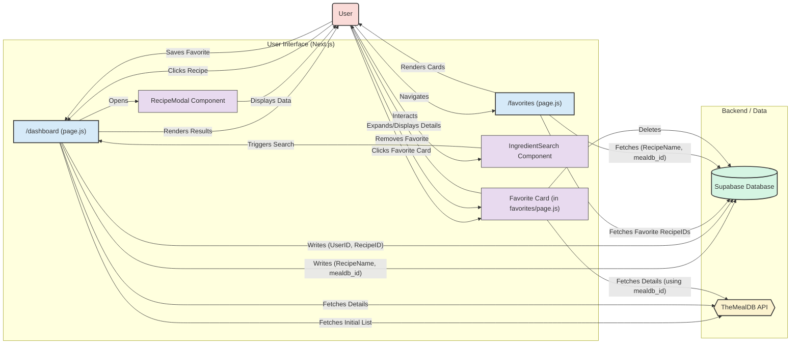

# ReciSearch

A web application allowing users to search for recipes based on ingredients, view details, and manage a list of favorite recipes. Built with Next.js, Tailwind CSS, Framer Motion, and Supabase.

## Recent Changes (Summary)

*   **Recipe Details Modal:** Implemented a modal view (`RecipeModal.js`) triggered from the search results page (`/dashboard`). Clicking a recipe card now opens this modal, displaying the full recipe details (image, ingredients, instructions) fetched from TheMealDB API. Includes smooth animations and click-outside-to-close functionality.
*   **Expandable Favorites:** Revamped the favorites page (`/favorites`) to use expandable cards. Clicking a favorite recipe card now fetches detailed information from TheMealDB API (using a stored `mealdb_id`) and displays a compact view with key ingredients, truncated instructions, and a "Remove Favorite" button. Uses Framer Motion for layout animations.
*   **Database Update:** Modified the Supabase `Recipe List` table schema to include a `mealdb_id` column. Updated the recipe saving logic in `/dashboard` to store this ID, enabling accurate detail fetching on the favorites page.

## Core Features & Workflow

*   **Authentication:** Users can register and log in (handled by `/register`, `/login` pages and Supabase Auth).
*   **Recipe Search (`/dashboard`):**
    *   Uses `IngredientSearch.js` component for adding/excluding ingredients.
    *   Fetches initial recipe list from MealDB based on the primary included ingredient.
    *   Fetches full details for each potential match.
    *   Filters results client-side based on all include/exclude criteria.
    *   Displays results as cards.
    *   Clicking a card opens the `RecipeModal.js`.
    *   "Save" button adds the recipe to the user's favorites via Supabase (`Recipe List` and `Favorites List` tables), storing both `RecipeName` and `mealdb_id`.
*   **Favorites (`/favorites`):**
    *   Fetches the user's favorite recipe IDs and associated `mealdb_id`s from Supabase.
    *   Displays favorite recipes as cards.
    *   Clicking a card expands it, fetches details from MealDB using `mealdb_id` if needed, and shows a compact view (image, key ingredients, truncated instructions).
    *   "Remove Favorite" button deletes the entry from the Supabase `Favorites List` table and updates the UI.

## Technical Stack

*   **Framework:** Next.js (React)
*   **Styling:** Tailwind CSS
*   **Animations:** Framer Motion
*   **Backend:** Supabase (Database & Auth)
*   **Recipe Data:** TheMealDB API

## Application Flow Diagram



## Setup & Running

1.  **Clone the repository (if applicable).**
2.  **Install dependencies:**
    ```bash
    cd reciearch
    npm install
    ```
3.  **Set up Supabase:**
    *   Create a Supabase project.
    *   Create the necessary tables (`Recipe List`, `Favorites List`, ensure `Recipe List` has `RecipeID` (PK), `RecipeName` (text), `mealdb_id` (text), and `Favorites List` has `id` (PK), `userid` (FK to auth.users), `recipeid` (FK to Recipe List)). Enable Row Level Security (RLS) as needed.
    *   Create a `.env.local` file in the `reciearch` directory.
    *   Add your Supabase Project URL and Anon Key to `.env.local` as well as your email.js key, service_id, and template_id:
        ```
        NEXT_PUBLIC_SUPABASE_URL=YOUR_SUPABASE_URL
        NEXT_PUBLIC_SUPABASE_ANON_KEY=YOUR_SUPABASE_ANON_KEY
        NEXT_PUBLIC_EMAIL_PUBLIC_KEY=I6Yu1QbbYPB91kGEf
        NEXT_PUBLIC_SERVICE_ID=service_8nvr40u
        NEXT_PUBLIC_TEMPLATE_ID=template_oyy6g88
        ```
4.  **Run the development server:**
    ```bash
    npm run dev
    ```
5.  Open [http://localhost:3000](http://localhost:3000) in your browser.
